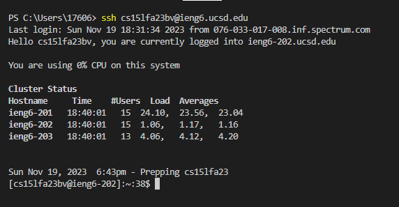
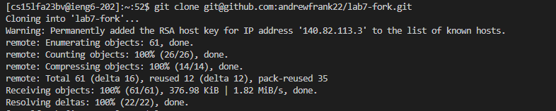
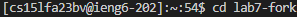
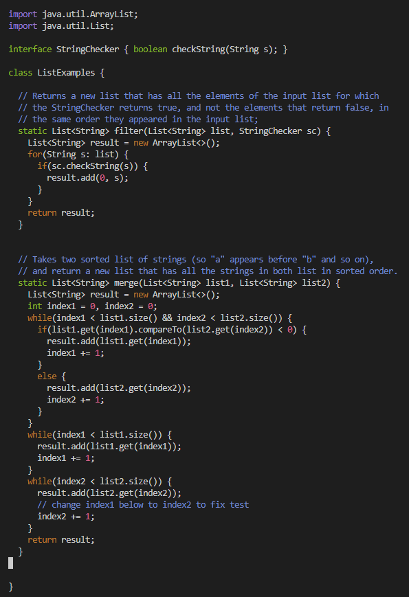
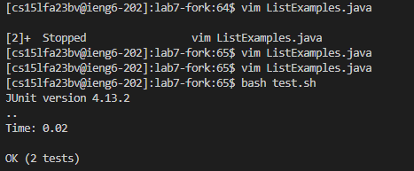
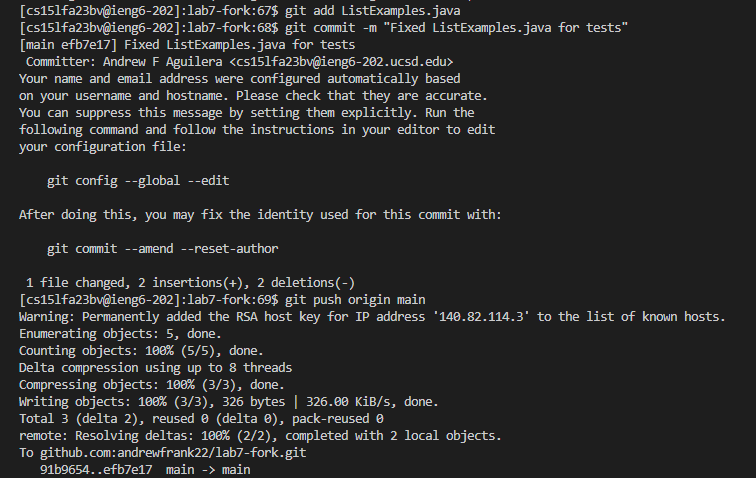

# Lab-Report-4---Vim-Week-7-
For the steps 4-9 from the lab

1) Log into ieng6
   I type:
   > ssh cs15lfa23bv@ieng6.ucsd.edu <enter>
   
  
  
2) Clone your fork of the repository from your Github account (using the SSH URL)
    I type:
   > git clone git@github.com:andrewfrank22/lab7-fork.git <enter>
   
   This works only after setting up SSH keys for my ieng6 account in the terminal (as stated in the steps of the lab)
   
   
   
4) Run the tests, demonstrating that they fail
   First, I need to go to the cloned repository
   
   
   
   > cd lab7-fork <enter>

  Then, to actually run the tests and analyze the results
  > bash test.sh <enter>
  
   
   
4) Edit the code file ListExamples.java to fix the failing test (as a reminder, the error in the code is just that index1 is used instead of index2 in the final loop in merge)
   First I open the file with vim
   > vim ListExamples.java
     
  Looking at the contents of ListExamples.java, I clicked "j" key 43 times to go down and the "l" key 12 times to go right, finally reaching the line I need to edit.
  Next, I press "i" key to enter INSERT mode; I press backspace to remove the "1" from "index1" and replace it with a "2"
 Then, to exit INSERT mode I press

> <esc>
Finally, I type :wq to save my edits and exit vim. 

5) Run the tests, demonstrating that they now succeed
Similar to the 3rd step, to analyze if our edits make the tests run correctly\
> bash test.sh <enter>

   
   
6) Commit and push the resulting change to your Github account
The git add command is necessary to choose what file is getting commited
> git add ListExamples.java <enter>

And for the actual commit
> git commit -m "Fixed ListExamples.java for tests" <enter>

To push the changes to the file on my Github account
> git push origin main <enter>

   
